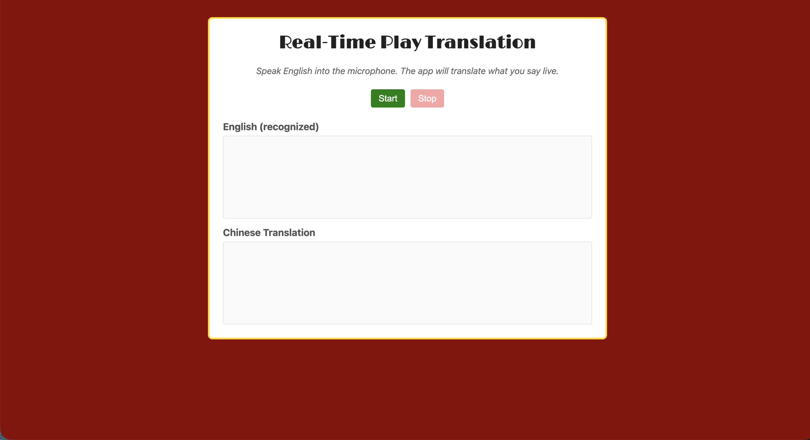
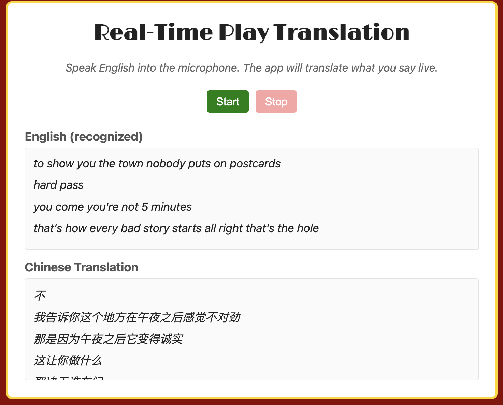

# CS515 Project — Real-Time Play Translation


## Overview

A real-time English → Simplified Chinese translator designed for live theatre, lectures, and conference settings. The speaker talks into a microphone, and the browser streams both the recognized English text and a Chinese translation live, line by line, as the speech unfolds.

**Problem it solves:** Live performances and talks can be hard to follow for audience members who don't speak the speaker's language. Conventional subtitle workflows require pre-written translations and tight cue synchronization. This project provides an on-the-fly translation overlay that reacts to spontaneous speech with low perceived latency, requires no custom hardware, and runs entirely on free APIs.

**Purpose:** Build an end-to-end web application that demonstrates browser-based speech recognition, a small Flask backend, a free third-party translation service, and throttled real-time UI updates — all wired together for a smooth live experience.

---

## Usage Instructions

### Prerequisites

Make sure the following are installed before you begin:

| Requirement | Notes |
|---|---|
| **Python 3.9+** | [Download here](https://www.python.org/downloads/) |
| **Git** | [Download here](https://git-scm.com/downloads) |
| **Chrome or Edge** | Required — Firefox and Safari do not support the Web Speech API |

### 1. Clone the repository

```bash
git clone https://github.com/StanVJacob/CS515_Project.git
cd CS515_Project
```

### 2. Create a virtual environment

A virtual environment keeps this project's dependencies isolated from your system Python.

**macOS / Linux:**

```bash
python3 -m venv venv
source venv/bin/activate
```

**Windows (PowerShell):**

```powershell
python -m venv venv
venv\Scripts\Activate.ps1
```

> You'll know the environment is active when your terminal prompt is prefixed with `(venv)`.

### 3. Install dependencies

```bash
pip install -r requirements.txt
```

This installs:

- **Flask** — minimal web server for the `/translate` endpoint
- **deep-translator** — wraps Google Translate's free public endpoint

### 4. Run the application

```bash
python app.py
```

You should see output similar to:

```
 * Serving Flask app 'app'
 * Debug mode: on
 * Running on http://127.0.0.1:5001
```

Open **http://127.0.0.1:5001** in Chrome or Edge, click **Start**, and grant microphone access when prompted.

> **macOS users:** Port `5001` is used to avoid a conflict with AirPlay Receiver, which occupies port `5000` by default. If `5001` is also taken, edit the last line of `app.py` to choose another port.

### Deactivating the environment

When you're done working, exit the virtual environment with:

```bash
deactivate
```

Re-activate it next time with `source venv/bin/activate` (macOS/Linux) or `venv\Scripts\Activate.ps1` (Windows).

---

## Tech Stack

### Frontend
- **HTML5 / CSS3** — page structure and styling
- **Vanilla JavaScript (ES6+)** — no frameworks, no build step
- **Web Speech API** — browser-native speech recognition (no audio data ever leaves the browser)

### Backend
- **Python 3.9+** — server runtime
- **Flask** — minimal HTTP server exposing the `/translate` endpoint
- **deep-translator** — Python wrapper around Google Translate's free public endpoint

### Architecture flow

1. **Voice → Text** (browser): Web Speech API streams interim and final transcripts.
2. **Text → Server**: JSON payload sent via `fetch()` to `POST /translate`.
3. **Server → Translation API**: Flask calls `deep_translator.GoogleTranslator` to translate the text.
4. **Translation → UI**: JSON response rendered live, with throttled interim updates so partial sentences appear in grey italic and finalized translations replace them in black.

### Testing
- **unittest** (Python standard library) — used in `test_hw7.py`. Run with `python -m unittest test_hw7.py -v`.

---

## Credits

- **Web Speech API** — Mozilla Developer Network: <https://developer.mozilla.org/en-US/docs/Web/API/Web_Speech_API>
- **deep-translator** — official documentation: <https://deep-translator.readthedocs.io/en/latest/>
- **Flask** — official documentation: <https://flask.palletsprojects.com/>

---

## Screenshots





---

## Developers

| Name | Responsibility |
|---|---|
| _Fan_ | _Back-end_ |
| _Stan_ | _Front-end_ |
| _Jay_ | _Back-end_ |